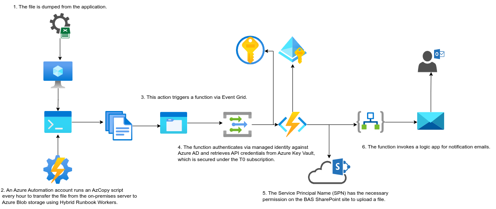

# VICGOV - Azure Go Fex

## Table of Contents
1. [Introduction](#1-introduction)
   1. [Overview](#11-overview)
2. [Go Fex Sharepoint Integration Process Reports](#2-go-fex-sharepoint-integration-process-reports)
3. [Logical Architecture](#3-logical-architecture)
   1. [Logical System Component Overview](#31-logical-system-component-overview)
4. [Used By](#used-by)

## 1. Introduction
### 1.1 Overview

Managing AAD roles across multiple tenants can be challenging, especially when it involves minimizing administrative overhead. The VICGOV - Azure Go Fex project aims to simplify this process and make it easier to maintain.

This document provides a high-level overview of the workflow for transferring files from the GoFex SFT client to the SharePoint directory https://****.sharepoint.com/sites/****/****/Technical Documents/GoFex Reporting. It also includes information on how administrators are notified of job status through alert emails. Additionally, a detailed troubleshooting guide is included.

## 2. Go Fex Sharepoint Integration Process Reports
- Description: MS SharePoint integration from the on-prem server.
- Priority: 3
- Owners: Tier 0

## 3. Logical Architecture
### 3.1 Logical System Component Overview

The logical architecture of the VICGOV - Azure Go Fex project is as follows:

1. The file is dumped from the application.
2. An Azure Automation account runs an AzCopy script every hour to transfer the file from the on-premises server to Azure Blob storage using Hybrid Runbook Workers.
3. This action triggers a function via Event Grid.
4. The function authenticates via managed identity against Azure AD and retrieves API credentials from Azure Key Vault, which is secured under the T0 subscription.
5. The Service Principal Name (SPN) has the necessary permission on the BAS SharePoint site to upload a file.
6. The function invokes a logic app for notification emails.

## Used By

This project is used by the following teams:

- BAS
- Cloud Platform
